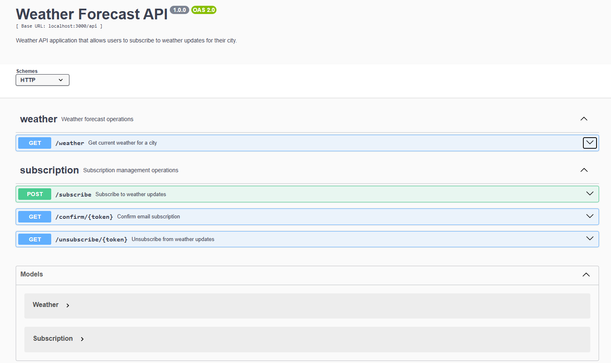
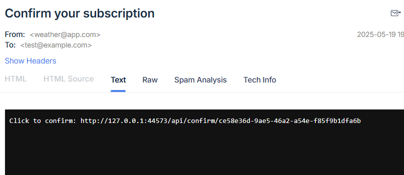
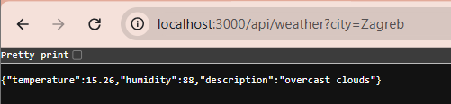

# 🌦️ Weather Subscription API

This project provides a simple weather forecast API that allows users to subscribe to weather updates for a specific city. Users receive confirmation emails and can unsubscribe at any time.

## ✅ Features

- Subscribe to weather updates for a selected city and frequency (daily/hourly)
- Confirm subscription via email token
- Unsubscribe via tokenized link
- Get current weather for a city (using WeatherAPI.com)
- Fully dockerized
- Includes functional tests with Jest and Supertest
- Emails sent safely using Mailtrap for development

---

## 🚀 How to Run Locally (Docker)

```bash
git clone https://github.com/dimitro1921/weather_subscription.git
cd weather_subscription
docker compose up --build
```

This will start:

- the Node.js API server at `http://localhost:3000`
- the PostgreSQL database
- optional test container

To run tests:

```bash
docker compose run test
```

---

## 🔌 API Endpoints

| Method | Endpoint                    | Description                            |
|--------|-----------------------------|----------------------------------------|
| GET    | `/api/weather?city=Lviv`    | Get current weather                    |
| POST   | `/api/subscribe`            | Subscribe an email for updates         |
| GET    | `/api/confirm/:token`       | Confirm email subscription             |
| GET    | `/api/unsubscribe/:token`   | Unsubscribe using the token            |

All endpoints return JSON responses.


---

## ✉️ Email Delivery

- This project uses [Mailtrap.io](https://mailtrap.io/) for safe email testing in development.
- Confirmation emails contain links to confirm or unsubscribe.
- Ready to switch to Gmail, SendGrid or any SMTP by modifying `utils/mailer.js`.

---

## 🧪 Testing

```bash
docker compose run test
```

The test suite covers:

- Weather forecast endpoint

- Email subscription logic

- Confirmation and unsubscription flows

- Error handling (missing parameters, invalid tokens, etc.)

✅ Tests are also run automatically when starting the test container via docker compose up, as defined in docker-compose.yml.


## 🖼️ Demo 
Email sent via Mailtrap




---

## 📁 Technologies Used

- Node.js + Express
- Sequelize + PostgreSQL
- Nodemailer
- Mailtrap (for email testing)
- Jest + Supertest (for tests)
- Docker + Docker Compose

---

## 📝 Notes

> For demonstration purposes, Mailtrap is used instead of a real SMTP provider.
> All email logic is abstracted and easily switchable to production services.

---

## 📬 Contact

Created for Genesis Software Engineering School 5.0 // Case  
Author: dimitro1921

---

## Demo

Zagreb current weather



Subscribe to weather updates for Zagreb